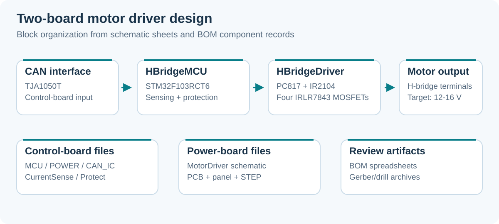

# PIF RYA 2025 Motor Driver Hardware

**A two-board motor-driver design: STM32/CAN control and an optocoupled MOSFET H-bridge.**

STM32F103RCT6 · TJA1050 · PC817 · IR2104 · Altium Designer

<a id="english"></a>

**English** · [Tiếng Việt](#tieng-viet)

Hardware design files for the Pay It Forward RYA 2025 robot project. The control board provides the MCU, CAN interface, power and sensing/protection circuits. A separate power board drives the motor through two half-bridge gate drivers and four N-channel MOSFETs.



*Block diagram based on the board folders, schematic sheet names and committed BOMs. It illustrates the design organization.*

## What is included

| Board | Contents | Parts recorded in the BOM |
|---|---|---|
| `1.HBridgeMCU` | MCU, CAN, power, current sensing, protection and driver connector | STM32F103RCT6, TJA1050T and protection/power components |
| `2.HBridgeDriver` | Isolated control inputs, gate drivers, MOSFET bridge and motor output | Two PC817 optocouplers, two IR2104SPBF drivers, four IRLR7843 MOSFETs |

The earlier project documentation gives **12-16 V** as the motor-supply design target. Component ratings in the BOM should be read as individual part specifications; a verified board-level continuous current or thermal limit is not provided in this checkout.

## Design files

```text
PIF_RYA_2025_Hardware/
├── 1.HBridgeMCU/
│   ├── 1.Project/             # Complete Altium project and local copies
│   ├── 2.Schematic/           # MCU, CAN, power, sensing and protection sheets
│   ├── 3.Layout/              # PCB and panel documents
│   ├── 4.Mechanic/            # STEP and PCB mechanical outputs
│   ├── 5.Gerber/              # Archived fabrication outputs
│   └── 6.BOM/                 # BOM workbook and Altium BOM document
└── 2.HBridgeDriver/            # Same organization for the power board
```

| Resource | Control board | Power board |
|---|---|---|
| Project | [RYA_MotorMCU.PrjPcb](1.HBridgeMCU/1.Project/RYA_MotorMCU/RYA_MotorMCU.PrjPcb) | [RYA_MotorDriver.PrjPcb](2.HBridgeDriver/1.Project/RYA_MotorDriver/RYA_MotorDriver.PrjPcb) |
| Schematic sheets | [2.Schematic](1.HBridgeMCU/2.Schematic) | [2.Schematic](2.HBridgeDriver/2.Schematic) |
| PCB layout | [HBridgeMainBoard.PcbDoc](1.HBridgeMCU/3.Layout/HBridgeMainBoard.PcbDoc) | [RYA_MotorDriver.PcbDoc](2.HBridgeDriver/3.Layout/RYA_MotorDriver.PcbDoc) |
| Mechanical model | [HBridgeMainBoard.step](1.HBridgeMCU/4.Mechanic/HBridgeMainBoard.step) | [RYA_MotorDriver.step](2.HBridgeDriver/4.Mechanic/RYA_MotorDriver.step) |
| Bill of materials | [BOMHBridgeMCU.xlsx](1.HBridgeMCU/6.BOM/BOMHBridgeMCU.xlsx) | [BOMHBridgeDriver.xlsx](2.HBridgeDriver/6.BOM/BOMHBridgeDriver.xlsx) |
| Fabrication archive | [5.Gerber](1.HBridgeMCU/5.Gerber) | [5.Gerber](2.HBridgeDriver/5.Gerber) |

## Review the design

1. Clone the repository:

   ```bash
   git clone https://github.com/TuanLinh05/PIF_RYA_2025_Hardware.git
   ```

2. Open the appropriate `.PrjPcb` in **Altium Designer**. Start with the complete project under `1.Project`; the numbered folders also hold exported/separated design documents.
3. Compile the schematic project, inspect sheet connections and compare the PCB with its schematic and BOM.
4. Review board-to-board control signals, ground/isolation boundaries, supply connections and motor output in the actual schematic before assembly.
5. Inspect the Gerber/drill archive for the selected PCB revision before manufacturing.

Both `5.Gerber` directories contain an archive named `Project Outputs for RYA_MotorMCU.zip`. The filename alone does not identify the intended board; inspect its internal artwork and revision. The checkout includes several copies of project documents, so confirm which copy you edit before regenerating outputs.

## Scope and reuse

This repository supplies **hardware design artifacts**. It does not contain a motor-control firmware application or a published test report establishing electrical/thermal performance. Firmware, control timing, CAN command protocol and measured current limits need their own implementation or validation.

Preserve any component-library and third-party model notices when reusing the Altium/STEP artifacts.

---

<a id="tieng-viet"></a>

## Tiếng Việt

[English](#english) · **Tiếng Việt**

Phần cứng điều khiển động cơ cho robot **PIF RYA 2025**, gồm hai board:

- **HBridgeMCU:** STM32F103RCT6, giao tiếp CAN qua TJA1050T, nguồn, đo dòng và các khối bảo vệ.
- **HBridgeDriver:** hai optocoupler PC817, hai IC lái IR2104SPBF và bốn MOSFET IRLR7843 tạo cầu H.

Sơ đồ đầu README minh họa tổ chức thiết kế dựa trên các sheet schematic và BOM. Tài liệu cũ đặt mục tiêu nguồn động cơ **12-16 V**; thông số dòng của linh kiện trong BOM chưa xác nhận dòng liên tục hoặc giới hạn nhiệt của cả board.

### Mở và sử dụng

1. Clone repo, mở project Altium của board cần xem trong `1.Project`.
2. Đối chiếu schematic, layout, BOM và mô hình STEP bằng các liên kết ở [bảng file thiết kế](#design-files).
3. Kiểm tra chân nối hai board, ranh giới cách ly, nguồn và ngõ ra động cơ theo schematic thực tế.
4. Xem nội dung Gerber/drill và xác nhận revision trước khi gửi sản xuất.

Mỗi board có project, schematic, PCB/panel, STEP, Gerber và BOM. Có nhiều bản sao tài liệu; cần xác định đúng project đang chỉnh sửa. Hai thư mục Gerber dùng cùng tên ZIP `Project Outputs for RYA_MotorMCU.zip`, vì vậy phải kiểm tra nội dung thay vì dựa vào tên file.

Repo hiện cung cấp **thiết kế phần cứng**. Firmware điều khiển, giao thức lệnh CAN và báo cáo đo điện/nhiệt cần được triển khai hoặc kiểm tra riêng. Giữ ghi nhận thư viện/model của bên thứ ba khi tái sử dụng.

---

Designed for Pay It Forward RYA 2025 by [Vu Tuan Linh](https://github.com/TuanLinh05) · HCMUT.
